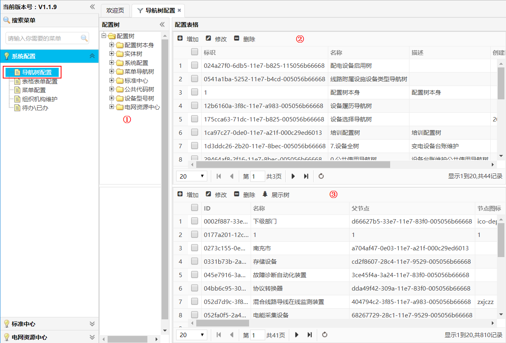

= 生产应用(PMS)前端框架关键技术说明
Qu Songtao;
v1.0.0
:lang: zh-cmn-Hans
:doctype: book
:description: 生产应用(PMS)前端框架关键技术说明
:icons: font
:source-highlighter: highlightjs
:linkcss!:
:numbered:
:idprefix:
:toc: left
:toc-title: 导航目录
:toclevels: 3
:experimental:

== 目的
引导开发人员，快速实现前端页面中表单、表格、树的生成。通过梳理前端关键技术，形成标准文档便于系统运维，同时使扩展伸缩更简单。

== 导航树配置
用于配置维护生产系统各业务场景导航树，包括各专业设备树（全树、站内一次、二次设备、自动化设备等）、组织机构树、菜单树、公共代码树、实体配置树等。

*导航树设计思路：* 任何一张表,任何字段都可以通过配置实现树的生成,每棵树的主信息配置存放在fw_tree_conf表,该表主要管理顶层树,顶层树下的分支树配置存放于
fw_tree_info明细表,该表配置有主表的关联ID,同时配置树数据来源的表名称,查询条件,层级关系。

*菜单路径：* menu:系统配置[导航树配置]

[NOTE]
====
<1> 系统中已有配置树
<2> fw_tree_conf表中列表数据,单击显示该节点的树分支(fw_tree_info)信息
<3> fw_tree_info表中列表数据
====

*源文件路径：* pms-html/pms/sysConfig/navTree.html +
*数据库表：*

.导航树配置表（fw_tree_conf）
[source,sql]
----
CREATE TABLE `fw_tree_conf` (
  `id`          char(36)     NOT NULL     COMMENT '设备ID',
  `name`        varchar(100) DEFAULT NULL COMMENT '名称',
  `description` varchar(128) DEFAULT NULL COMMENT '描述',
  `create_time` date         DEFAULT NULL COMMENT '创建时间',
  `parent`      varchar(42)  DEFAULT NULL COMMENT '父节点',
  PRIMARY KEY (`id`)
) ENGINE=InnoDB DEFAULT CHARSET=utf8;
----
.导航树节点表（fw_tree_info）
[source,sql]
----
CREATE TABLE `fw_tree_info` (
  `id`          char(36)     NOT NULL     COMMENT '设备ID',
  `name`        varchar(100) DEFAULT NULL COMMENT '名称',
  `pid`         char(36)     DEFAULT NULL COMMENT '上级节点',
  `nodeicon`    text                      COMMENT '节点图片',
  `nodetype`    varchar(20)  DEFAULT NULL COMMENT '节点类型',
  `nodetext`    text                      COMMENT '节点显示',
  `nodetable`   text                      COMMENT '节点表',
  `nodefilter`  text                      COMMENT '节点过滤',
  `isgroup`     varchar(20)  DEFAULT NULL COMMENT '是否分组',
  `create_time` date         DEFAULT NULL COMMENT '创建时间',
  `treeid`      char(36)     DEFAULT NULL COMMENT '树ID',
  `expandvalue` varchar(200) DEFAULT NULL COMMENT '扩展字段',
  `reversesql`  text                      COMMENT '方向查询SQL',
  `ssxt`        varchar(100) DEFAULT NULL COMMENT '所属系统',
  `px`          int(10)      DEFAULT NULL COMMENT '排序',
  PRIMARY KEY (`id`)
) ENGINE=InnoDB DEFAULT CHARSET=utf8;

----

=== 创建新树节点
*注:* 如果是根节点,则父节点留空

image::yl01.png[]

=== 创建树子节点

.在对应的父节点上增加子节点

image::yl02.png[]

.在子节点上增加下级节点信息

image::yl03.png[]

=== 配置参数说明
fw_tree_info参数说明

image::yl04.png[]

[NOTE]
====
- *ID:*  唯一主键号 36位
- *名称:* 名称定义
- *父节点:* 父节点ID值
- *节点图标:*  --
- *节点类型:* 具有业务含义的自定义字符串
- *节点名:* 以id,text的形式给出,在生成数时会以id和text生成树节点信息,如果节点表中午id,text字段,可以通过定义别名,如: myid id,name text
- *节点表:* 树节点数据来源表
- *过滤条件:* 查询条件
- *是否分组:* 预留
- *创建时间:* 创建时间
- *树:* 对应fw_tree_conf中的id
- *扩展值:* 自定义树节点的其它参数,为节点表中的其它字段,字段名称不可写错
- *反查SQL:* 预留
- *所属系统:* 预留
- *排序:* 顺序号
- *对应的执行* #select id,name text,${扩展值} from ${节点表} where ${过滤条件}#
====

[NOTE]
====
EasyUI tree对应的扩展代码见: #/pms/common/js/common-ui.js#
====

=== 使用详细说明
[source,javascript]
----
$("#testTree").tree({
    url:"http://localhost:10700/framework/tree/{treeID}", //<1>
    lines:true,//显示虚线效果
    onClick:function(node){
        //do some
    }
});
----
[NOTE]
====
<1> treeID对应fw_tree_conf中的ID值
====

== 表格表单配置

=== 配置详细说明

=== 使用详细说明

== 完毕